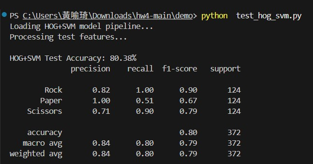

# 剪刀石頭布手勢辨識系統 (HOG + SVM)

本專案實作了一個基於影像 HOG (Histogram of Oriented Gradients) 特徵提取與 SVM (Support Vector Machine) 分類器的手勢辨識系統，並支援樹莓派 (Raspberry Pi) 或一般電腦的即時相機辨識。

---

## 📂 資料夾結構與核心程式說明

```text
hw4/
├── dataset/                    # 手勢影像資料集
│   ├── train/                  # 訓練集影像 (Rock, Paper, Scissors)
│   └── test/                   # 測試集影像 (Rock, Paper, Scissors)
├── train/                      # 訓練相關程式
│   └── train_hog_svm.py        # 模型訓練腳本
│                               # 流程：灰階化 -> HOG 特徵提取 -> 線性 SVM 訓練 -> 存檔至 demo 目錄
└── demo/                       # 測試與相機展示程式
    ├── rps_hog_svm_model.pkl   # 已訓練好的 HOG+SVM 權重模型
    ├── test_hog_svm.py         # 測試集評估程式，用以輸出準確率與分類報告
    └── camera_hog_svm.py       # 即時相機辨識程式
                                # 核心：ROI擷取 -> 灰階HOG預測 -> 膚色遮罩指縫雙重驗證 -> 輸出結果
```

### 核心檔案功能介紹

#### 1. `train/train_hog_svm.py` (模型訓練)
* **功能**：讀取訓練集與測試集手勢影像，對影像進行**灰階化**與高質量的**影像縮放**，最後提取 **HOG 特徵**。
* **模型**：使用線性支持向量機 (`SVC(kernel='linear')`) 進行分類訓練，並將訓練好的模型存檔為 `demo/rps_hog_svm_model.pkl`。

#### 2. `demo/rps_hog_svm_model.pkl` (訓練好的模型檔)
* **功能**：由 `train_hog_svm.py` 訓練產生，儲存了 SVM 分類器與其權重參數。測試與相機即時辨識程式皆會載入此檔案進行預測。

#### 3. `demo/test_hog_svm.py` (模型測試與評估)
* **功能**：載入訓練好的 `rps_hog_svm_model.pkl`，讀取 `dataset/test` 中的影像，提取其 HOG 特徵，並進行預測。
* **輸出**：輸出模型對測試集的**整體準確率 (Accuracy)** 與**分類詳細報告 (Precision, Recall, F1-Score)**。

#### 4. `demo/camera_hog_svm.py` (即時相機辨識)
* **功能**：啟動鏡頭擷取影像，設定一個 ROI (感興趣區域) 方框供使用者放置手掌。
* **預處理**：提取 ROI 區域的**灰階 HOG 特徵**送入 SVM 模型進行手勢預測。
* **雙重驗證機制**：同時利用 YCrCb 色彩空間過濾膚色以計算手部面積（防空畫面誤判），並使用 OpenCV 的 `findContours` 與 `convexityDefects` 計算指縫數量進行雙重驗證（例如：預測為 Rock 且指縫為 0、Scissors 且指縫為 1、Paper 且指縫 $\ge 3$ 才視為有效），若不符合或機率過低則判定為 `Error`。

---

## 🛠️ 安裝與執行說明

### 1. 安裝環境套件
在終端機 (Terminal) 中執行以下指令安裝所需庫：
```bash
pip install scikit-learn opencv-python numpy joblib scikit-image
```

### 2. 模型測試評估
切換至 `demo` 資料夾並執行測試程式：
```bash
cd demo
python test_hog_svm.py
```

執行後的測試準確率與分類報告如下圖所示：



### 3. 執行相機即時辨識
切換至 `demo` 資料夾並執行相機程式 (需配備 webcam)：
```bash
cd demo
python camera_hog_svm.py
```
* 按下 `q` 鍵可退出相機畫面。


---

## 📋 評分標準

- 成功在 Raspberry Pi 4 上執行 test.py & carema.py 50%
- Demo 展示影片(carema) 15%
    - 從兩個模型中選擇較強的模型，寫一支程式將 carema 接收到的畫面接到模型上進行分類，並錄一段 demo 10 個手勢的短片
    - 執行 10 次手勢辨識，且須包含以下手勢
        - 石頭(Rock)
        - 剪刀(Scissors)
        - 布(Paper)
        - 其他錯誤手勢 (Error)
- 報告 35%
	- 需自行找兩個模型架構修改 20%
		- 至少需呈現 accuracy, precision, recall, F1-score
	- 需解釋更換模型原因及比較差異 15%
